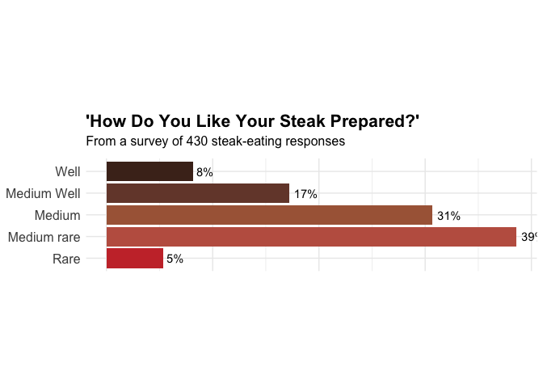

# BST 270: Individual Project
Keyao Zhan

## Introduction

The following notebook aims to satisfy the requirements for the
individual project component of BST 270: Reproducible Data Science,
taken Winter 2025.

#### Motivations and Reproducibility

I aim to reproduce the figure and the table from FiveThirtyEight’s [How
Americans Like Their
Steak](https://fivethirtyeight.com/features/how-americans-like-their-steak/).
I will utilize the provided dataset based on a survey testing 550 people
about their risk evaluation and steak preference, located at
`../data/steak-risk-survey.csv`.

## Setup

First, we load our required packages and required dataset. We utilize
the `dplyr`, `knitr` and `ggplot2` library to produce nice figures and
tables and process data efficiently.


    Attaching package: 'dplyr'

    The following objects are masked from 'package:stats':

        filter, lag

    The following objects are masked from 'package:base':

        intersect, setdiff, setequal, union

Here we remove the first two rows which are of no information.

<details class="code-fold">
<summary>Code</summary>

``` r
# Remove first two invalid rows
steak_data <- read.csv("../data/steak-risk-survey.csv",header = T)
steak_data = steak_data[-c(1,2),]
```

</details>

The original dataset has too long names and some irrelevant variables,
so we extract a new dataset that is useful for our analysis.

<details class="code-fold">
<summary>Code</summary>

``` r
# Filter and rename the dataset
steak_lottery_data = data.frame(lottery = steak_data$Consider.the.following.hypothetical.situations...br.In.Lottery.A..you.have.a.50..chance.of.success..with.a.payout.of..100...br.In.Lottery.B..you.have.a.90..chance.of.success..with.a.payout.of..20...br..br.Assuming.you.have..10.to.bet..would.you.play.Lottery.A.or.Lottery.B., eat_steak = steak_data$Do.you.eat.steak.,cook_steak = steak_data$How.do.you.like.your.steak.prepared.)
write.csv(steak_lottery_data, file = "../data/steak_lottery_data.csv")
head(steak_lottery_data)
```

</details>

        lottery eat_steak  cook_steak
    1 Lottery A       Yes Medium rare
    2 Lottery A       Yes        Rare
    3 Lottery B       Yes      Medium
    4 Lottery B       Yes      Medium
    5 Lottery A       Yes Medium rare
    6 Lottery A        No            

## Reproduce the table

The table in the article shows the pertange of steak preparation
preference of the people who choose a riskier lottery or a safer
lottery.

First we need to remove all the NA (or empty values) in lottery
variable, and focus on people who eats steak:

<details class="code-fold">
<summary>Code</summary>

``` r
df1 = steak_lottery_data %>%
  filter(lottery != "", eat_steak == "Yes")
dim(df1)
```

</details>

    [1] 426   3

There are 426 people who answered the lottery question and also eat
steak. Next we reproduce the table:

<details class="code-fold">
<summary>Code</summary>

``` r
kable(tb1*100,format = "pipe",digits = 1)
```

</details>

|             | Riskier lottery | Safer lottery |
|:------------|----------------:|--------------:|
| Well        |             7.3 |           9.0 |
| Medium Well |            16.1 |          18.1 |
| Medium      |            36.1 |          25.8 |
| Medium rare |            35.6 |          41.2 |
| Rare        |             4.9 |           5.9 |

**Comment:** We nearly recovered the table in the article, with slight
difference.

## Reproduce the figure

The figure shows the percentage of the steak preparation preference of
all steak eating interviewees. First we filter out all people who eat
steak.

<details class="code-fold">
<summary>Code</summary>

``` r
# Create the counting table
df2 = steak_lottery_data %>%
  filter(eat_steak == "Yes")

prep_names = c("Rare","Medium rare","Medium","Medium Well","Well")
df2.1 = data.frame(table(df2$cook_steak)[prep_names]/sum(table(df2$cook_steak))*100)
colnames(df2.1) = c("Cooked","Percentage")
df2.1
```

</details>

           Cooked Percentage
    1        Rare   5.348837
    2 Medium rare  38.604651
    3      Medium  30.697674
    4 Medium Well  17.209302
    5        Well   8.139535

Next we reproduce the plot in the article:

<details class="code-fold">
<summary>Code</summary>

``` r
# Reproduce the figure
gg = ggplot(df2.1, aes(x = Cooked, y = Percentage)) +
  geom_bar(stat = "identity", fill = rev(c("#4B2C20", "#754637", "#AA6546", "#C06050", "#C93535"))) +
  coord_flip() +  
  geom_text(aes(label = paste0(round(Percentage), "%")), hjust = -0.2) + 
  labs(
    title = "'How Do You Like Your Steak Prepared?'",
    subtitle = paste("From a survey of", sum(nrow(df2)), "steak-eating responses"),
    x = NULL,
    y = NULL
  ) +
  theme_minimal() +
  theme(
    plot.title = element_text(size = 16, face = "bold"),
    plot.subtitle = element_text(size = 12, margin = margin(b = 10)),
    axis.text.x = element_blank(),
    axis.text.y = element_text(size = 12),
    axis.ticks = element_blank(),
    aspect.ratio = 0.25
  )
gg
```

</details>



**Comment:** From the plot we see that we nearly reproduced the figure,
only with slight difference in the percentage.

<details class="code-fold">
<summary>Code</summary>

``` r
ggsave("../fig/steak_preference.png",plot = gg)
```

</details>

    Saving 7 x 5 in image

## Reflection on the reproducibility

This is a quite simple data analysis. The data is publicly available,
and the figure and the table are quite reproducible. I think the only
problem arises in the first two rows I removed. As these two rows are
indeed invalid ones, I guess the author made some mistakes when storing
the data as the csv file.
